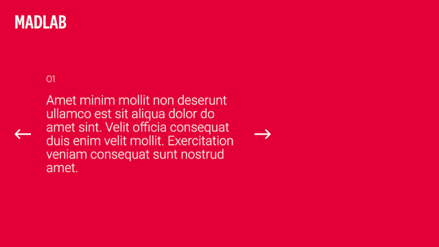

# Desafio - Fullstack (Resposta)

## O Desafio



A Landing page solicitada no desafio foi desenvolvida em duas partes, sendo elas,
api e front. Na api ficou toda a parte de back-end e manipulação dos dados. Já na
parte de front é onde ficou a exibição dos dados e interação com o usúario.

## Tecnologias envolvidas

- jquery (Utilizado nas requisições ajax e manipulação dos elementos)
- swipper.js (Carrosel da primeira seção)
- css
- html
- javascript
- php (Utilizado na api)
- codeigniter 3 (Utilizado para facilitar a implementação da lógica de negócio)
- mysql (Armazenamento dos dados)

## Requisitos

Para executar esta aplicação é necessário configurar um ambiente web:

 - Servidor php 5.3+
 - Mysql

Eu recomendo a instalação do xampp, pois ele já possui este ambiente configurado.

## Como configurar

Para rodar a aplicação basta extrair o conteúdo da pasta /front para a raiz do seu servidor php
(no xampp /htdocs) e copiar a pasta /api também para a raíz do servidor. Já com relação a configuração do banco de dados,
basta criar criar uma base com codificação de caracteres utf8_general_ci e preencher o arquivo .env localizado dentro da pasta /api.
Além de importar o arquivo db_api.sql para a base de dados criada anteriormente. 

Como deverá ficar a estrutura do projeto após instalação:

```shell

├── /api
│     ├── ...
│     └── .env
└── /assets
│     ├── /css
│     ├── /js
│     └── /img
└── index.html
```